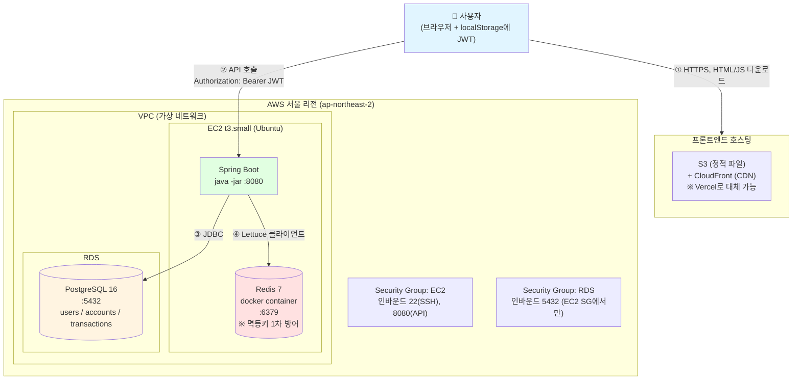
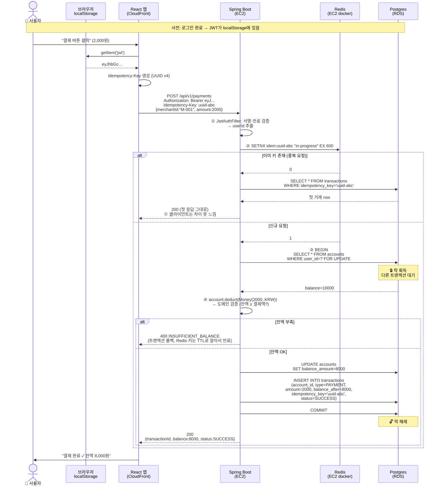
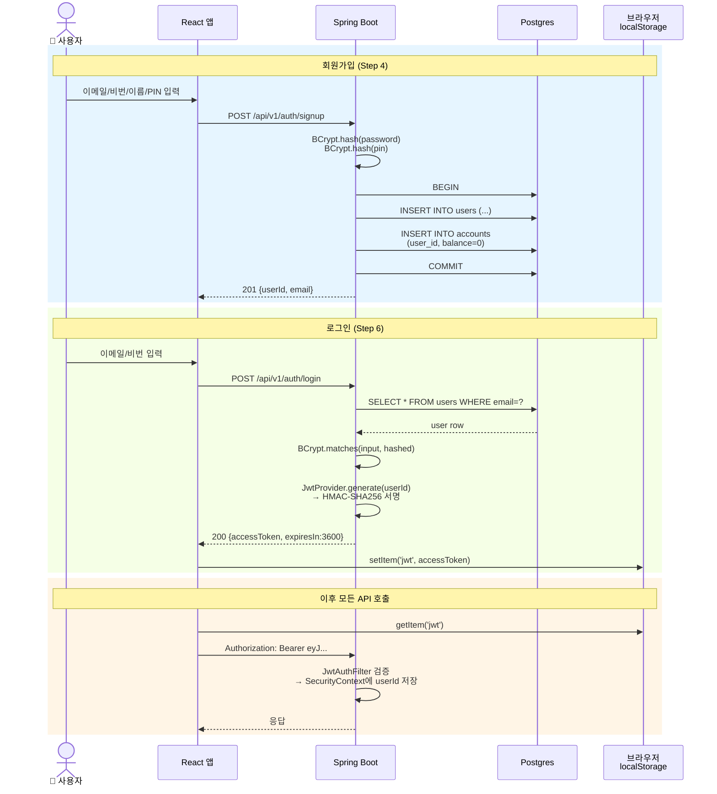

# Mini Pay — 아키텍처 & 데이터 흐름

> **목적**: B안 종착지(AWS 수동 배포 완료) 기준으로 "데이터가 어디에 저장되고 어떻게 흐르는지" 한눈에.
> **렌더링**: 이 파일 통째로 claude.ai에 붙여넣으면 mermaid 자동 렌더. 또는 https://mermaid.live 에 다이어그램만 따로 붙여도 됨.
>
> 📌 **2026-05-18 종결 기준**: 백엔드 Step 0~11 완료(`localhost:8080` 부팅 검증). AWS 배포(EC2/RDS/S3+CloudFront)는 학습 확장 후보로 보류. 본 문서의 EC2/RDS 부분은 "이렇게 배포할 것" 청사진 + 면접 답변지 자료.

---

## 1. 시스템 전체 아키텍처 (AWS 배포 후)

**핵심 포인트**
- **프론트와 백엔드는 다른 도메인** → CORS 설정 필수 (Step 4 진입 시 처리)
- **EC2 안에 Spring + Redis 같이** → 둘 사이는 `localhost:6379` 호출 (네트워크 비용 0)
- **DB만 RDS로 분리** → 백업/스냅샷 자동, 인스턴스 재시작해도 데이터 안전
- **HTTPS는 1주차에 안 함** (CloudFront는 무료, EC2는 LB+ACM 필요해서 시간 큼)

---

## 2. 데이터 저장 위치 매트릭스 ⭐

> "이 데이터 어디 있어?" 질문 한 방에 답하는 표

| # | 데이터 | 저장 위치 | TTL | 용도 | 사라지면? |
|---|---|---|---|---|---|
| 1 | 회원 (이메일·비번 해시·핀 해시) | Postgres `users` | 영구 | 로그인 검증 | 가입 다시 |
| 2 | 계좌 + 잔액 | Postgres `accounts` | 영구 | 잔액 관리 | **돈 사라짐 (절대 금지)** |
| 3 | 거래 내역 | Postgres `transactions` | 영구 | 조회·감사 | 영수증 분실 |
| 4 | 멱등키 (처리 중 마커) | Redis `idem:<uuid>` | 600초 | 결제 중복 1차 방어 (밀리초 응답) | 괜찮음 → 5번이 막아줌 |
| 5 | 멱등키 (영구 기록) | Postgres `transactions.idempotency_key UNIQUE` | 영구 | **최후 방어선** | 중복 결제 발생 |
| 6 | JWT 토큰 | **클라이언트 localStorage** | 1시간 (토큰 안에 만료시각) | 인증 | 재로그인 |
| 7 | 정적 자산 (HTML/JS/CSS) | S3 + CloudFront | 캐시 1년 | 프론트 SPA | 새로 빌드/배포 |
| 8 | 환경변수 (DB 비밀번호 등) | EC2 `application-prod.yml` | - | 설정 | 앱 부팅 안 됨 |

### 왜 이렇게 나눴나
- **Redis ↔ Postgres 이중 방어** = 빠르기(Redis) + 안전(Postgres) 둘 다 챙기려고. Redis만 쓰면 장애 시 중복 결제, Postgres만 쓰면 매 요청마다 DB 왕복.
- **JWT를 서버 저장 안 함** = 서버 무상태(stateless) → 나중에 EC2 2대로 늘려도 세션 동기화 필요 없음.
- **잔액은 Redis에 캐시 안 함** = 돈은 캐시 정합성 깨지면 사고. Postgres 비관적 락 한 번이 "캐시+DB 둘 다 관리"보다 훨씬 단순·안전.

---

## 3. 결제 데이터 흐름 (Step 8 핵심) ⭐

> 가장 복잡한 시나리오. 이 그림 하나면 면접에서 결제 설명 가능.

**이 그림에서 읽어내야 하는 것**
1. **JWT 검증은 모든 API 첫 단계** (Spring Security 필터에서 컨트롤러 진입 전에)
2. **Redis가 먼저, DB가 나중** — 빠른 거 먼저 통과시키고 정밀한 거 나중
3. **`FOR UPDATE`가 핵심** — 같은 계좌에 동시 결제 와도 한 줄씩 처리됨 (Step 8의 비관적 락)
4. **잔액 부족 시 Redis 키는 안 지움** — 어차피 600초 후 만료 + 같은 키 재시도해도 어차피 잔액 부족이라 같은 결과

---

## 4. 회원가입 + 로그인 흐름 (Step 4~6, 한 그림으로)

---

## 5. 로컬 (지금) vs AWS (2주차) 차이

| 컴포넌트 | 로컬 (Step 0~11) | AWS (배포 후) | 바뀌는 코드 |
|---|---|---|---|
| Postgres | docker-compose | RDS PostgreSQL | `application.yml`의 `url`만 |
| Redis | docker-compose | EC2 안 docker | 거의 안 바뀜 (`localhost:6379` 그대로) |
| Spring Boot | `./gradlew bootRun` | EC2에서 `java -jar app.jar` | 없음 (jar 빌드만) |
| 프론트 | `npm run dev` (Vite/Next) | S3 + CloudFront | API base URL만 환경변수로 |
| 비밀번호·시크릿 | `.env` | EC2 `application-prod.yml` | profile 분리 |
| 도메인/HTTPS | `localhost:8080` | EC2 퍼블릭 IP:8080 | 없음 (1주차는 IP 직노출) |

**핵심 통찰**: Spring profile (`dev`/`prod`)만 잘 분리해두면 코드 변경 없이 환경 전환 가능.

---

## 6. 13~14일 종착지 = 이 다이어그램이 전부 동작

이 문서의 모든 화살표가 실제로 통하는 게 B안 완료 조건.
- ❶ 사용자가 CloudFront URL 접속 → 회원가입
- ❷ 로그인 → JWT 받아서 localStorage 저장
- ❸ 충전 5,000원 → 결제 2,000원 → 거래내역에 2건
- ❹ 같은 결제를 다시 누르면 (`Idempotency-Key`로) 중복 안 됨
- ❺ Swagger에서 9개 시나리오 전부 통과 (`docs/ready.md` §4)

---

## 부록: 다이어그램 렌더링 방법

1. **claude.ai 추천** — 이 파일 통째로 복붙 → 아티팩트로 자동 렌더 (편집·확대 가능)
2. **mermaid.live** — 다이어그램 코드 블록 하나씩 복붙 → 즉시 렌더 + PNG 다운로드
3. **VS Code** — `Markdown Preview Mermaid Support` 확장 설치 → `Ctrl+Shift+V`
4. **GitHub** — `.md` 파일 push하면 GitHub가 자동 렌더 (포트폴리오용으로 좋음)
