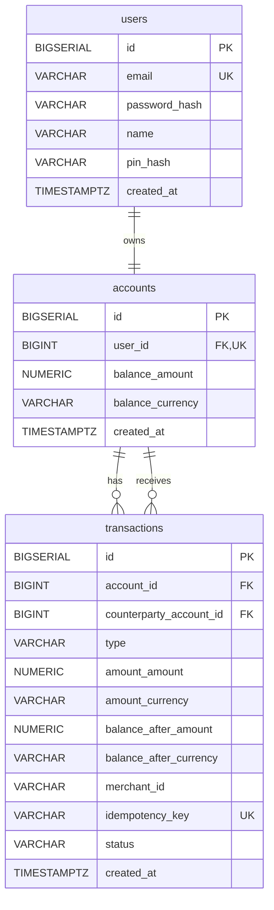
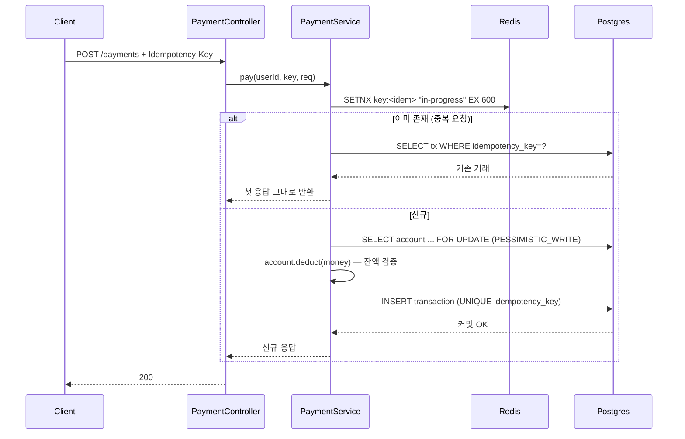
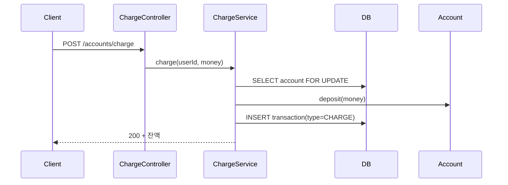
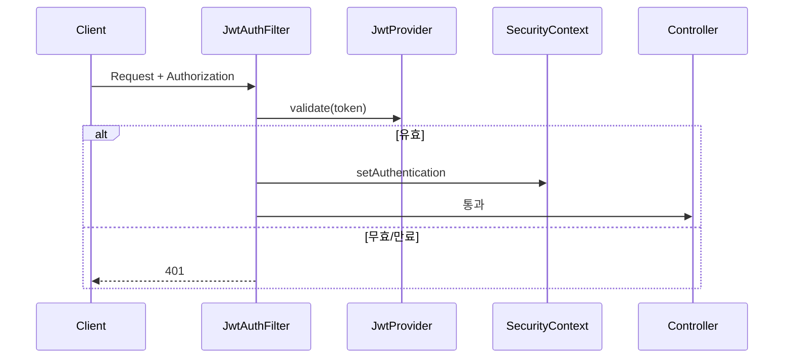

# Mini Pay — 준비물 (Ready)

> 코딩 시작 전 / 진행 중에 채워두는 산출물 모음.
> 목적은 "지금 빨리 만드는 것"이 아니라 **팀 프로젝트 들어갔을 때 한 번 돌려본 사람이 되어있는 것**.
> 이미 코딩 중이므로 **1·2·3·8 먼저, 나머지는 기능 개발하면서 점진적으로** 채운다.
>
> 🎉 **2026-05-18 Mini Pay 프로젝트 종결** — 시나리오 12/12 통과, ADR 11장 작성 완료.

---

## 1. 도메인 용어집 (Ubiquitous Language)

핵심 명사 — 엔티티/필드/메서드 이름의 진실.

| 용어 (KO) | 코드 식별자 | 정의 |
|---|---|---|
| 회원 | `User` | 시스템 사용자. 이메일·비밀번호·핀으로 식별 |
| 계좌 | `Account` | 회원 1명당 1개의 잔액 보관소 (1:1) |
| 거래 | `Transaction` | 잔액에 영향을 미치는 한 건의 사건 (충전/결제) |
| 금액 | `Money` | `(amount, currency)` 쌍의 값 객체 (VO) |
| 통화 | `Currency` | ISO 4217 코드. 현재 `KRW`만 |
| 거래유형 | `TransactionType` | `CHARGE`(충전), `PAYMENT`(결제), `TRANSFER`(이체) |
| 거래상태 | `TransactionStatus` | `SUCCESS`, `FAILED` (필요 시 `PENDING` 추가) |
| 가맹점 | `merchantId` | 결제 받는 외부 식별자 (자체 엔티티 X, 문자열 보관) |
| 멱등키 | `idempotencyKey` | 같은 요청 중복 처리 방지용 클라이언트 발급 ID |
| 상대 계좌 | `counterpartyAccountId` | 이체 수신자 계좌. `TRANSFER`만 NOT NULL, 그 외 NULL (DB CHECK) |
| 잔액 | `balance` | `Account.balanceMoney` — 음수 금지(DB CHECK) |
| 결제 토큰 | `JWT` | 인증·인가용 액세스 토큰. 1시간 만료 |

### ❌ 이번 버전에 안 넣을 것 (의도적으로 제외)
- 환불/취소 — `Transaction` 역연산
- 다중 통화/환전 — `Currency` enum은 확장만 열어두고 사용은 KRW로 고정
- 실명인증, 카드/은행 연동, OAuth 소셜 로그인
- 포인트/리워드/할인 정책

> ENFP 함정 방지: "안 할 것"을 명시해야 엔티티가 부풀지 않는다.

---

## 2. 핵심 유스케이스 (Use Case)

"사용자가 ___을 한다" 형태. 엔티티 메서드는 여기서 나온다.

1. 사용자가 이메일·비밀번호·핀으로 **회원가입**한다 → 가입 성공 시 `Account`도 동시 생성 (잔액 0)
2. 사용자가 이메일·비밀번호로 **로그인**하고 JWT를 받는다
3. 사용자가 본인 계좌에 **잔액을 충전**한다 (외부 결제 수단은 가짜로 가정)
4. 사용자가 **가맹점에 결제**한다 (잔액 차감, 멱등키 필수)
5. 사용자가 본인의 **거래내역을 조회**한다 (페이지네이션, 최신순) — 송금자/수신자 양쪽 시점 모두 포함
6. 시스템이 **잔액보다 큰 결제/이체를 거부**한다 (`InsufficientBalanceException`)
7. 시스템이 **동일 멱등키 재요청을 한 번만 처리**하고 같은 응답을 반환한다 (결제·이체 공통)
8. 시스템이 **동시 결제/이체 요청에서 잔액 정합성을 보장**한다 (비관적 락)
9. 사용자가 **다른 회원에게 이체**한다 (송금자 잔액 차감 + 수신자 잔액 증가, 멱등키 필수, 비관적 락)

### Step → 유스케이스 매핑
- Step 4 → ①
- Step 5·6 → ②
- Step 7 → ③·⑥
- Step 8 → ④·⑥·⑦·⑨ (결제 + 이체. 두 계정 동시 락 패턴은 이체에서 등장)
- Step 9 → ⑤
- Step 10 → ⑦·⑧ (통합 테스트)

---

## 3. ERD (Entity Relationship Diagram)

`V1__init.sql` + `V2__money_value_object.sql` + `V3__transfer.sql` 기준 현재 스키마.

```
users (1) ───── (1) accounts (1) ───── (N) transactions
```



### 결정 사항 (이미 결정됨)
| 포인트 | 결정 | 이유 |
|---|---|---|
| 금액 타입 | `NUMERIC(19,4)` (DB) / `BigDecimal` (Java) | 다중 통화 확장 가정. `Long`(원 단위)도 합리적이지만 외화 시 재설계 비용 큼 |
| 시간 타입 | `TIMESTAMPTZ` + `OffsetDateTime` | 시차/서머타임/글로벌 확장 대비 |
| Money 분할 | `(amount, currency)` 두 컬럼 | `@Embeddable` 매핑. JSON 한 컬럼은 인덱싱·집계 곤란 |
| User-Account | 1:1 (FK + UNIQUE) | 다계좌는 안 넣을 것에 명시 |
| 거래 표현 | 단일 행 + `type` enum + (TRANSFER 시) `counterparty_account_id` | 이체 추가됐지만 복식부기는 학습 범위 초과 → 송금자 시점 1행 + 수신자는 역조회 (ADR 0006) |
| 멱등키 | `transactions.idempotency_key UNIQUE` | DB UNIQUE = 최후 방어선. 1차 방어는 Redis SETNX |
| 삭제 정책 | 물리 삭제 (현재 정책 없음) | 거래는 어차피 영구 보관, soft delete 도입 시점은 회원 탈퇴 기능 들어올 때 |
| 인덱스 | `idx_transactions_account_id_created_at` | 거래내역 조회 = `WHERE account_id=? ORDER BY created_at DESC` |

### 현재 ERD에 빠진 것 (Step 진행하며 추가 검토)
- `transactions.user_id` 비정규화? — 현재는 `account_id`만. 조회 성능 문제 생기면 ADR 작성 후 추가
- `transactions.completed_at` — 상태 전이가 들어오면 필요
- 이체 시 **수신자 balance_after** — 송금자 시점 1행만 기록하므로 수신자 잔액 추적은 별도 쿼리(`accounts` 직접 또는 수신자 시점 최신 거래). 비정규화 필요해지면 ADR 0006 재검토 신호.

---

## 4. API 시나리오 (백엔드 + Swagger 프로젝트라 화면 대신)

화면 대신 **Swagger UI에서 사람이 직접 실행해볼 시나리오**가 산출물.

```
[가입~결제 골든 패스]
1. POST /api/v1/auth/signup        → 201 + 회원/계좌 생성
2. POST /api/v1/auth/login         → 200 + JWT
3. POST /api/v1/accounts/charge    → 200 + 잔액 10,000원
4. POST /api/v1/payments           → 200 + 잔액 8,000원 (2,000원 결제)
5. POST /api/v1/transfers          → 200 + 송금자 잔액 5,000원 (3,000원 이체 → 수신자 잔액 +3,000원)
6. GET  /api/v1/transactions       → 200 + 거래 3건 (최신순, 송금자/수신자 양쪽 시점 포함)

[엣지 케이스]
7. POST /api/v1/payments (잔액 초과)        → 400 INSUFFICIENT_BALANCE
8. POST /api/v1/payments (동일 Idempotency-Key 재전송) → 첫 응답과 동일 결과, 거래는 1건
9. POST /api/v1/transfers (자기 자신에게 이체) → 400 INVALID_TRANSFER_TARGET
10. POST /api/v1/transfers (잔액 초과)         → 400 INSUFFICIENT_BALANCE
11. POST /api/v1/payments (JWT 누락)        → 401
12. POST /api/v1/auth/signup (중복 이메일)  → 409 DUPLICATE_EMAIL
```

이 12개를 Swagger에서 실제로 통과시키는 게 **Step 11 = 프로젝트 종결 조건**.

> ✅ **2026-05-18 종결 완료** — 12/12 전부 통과. 검증 결과는 [`docs/swagger-e2e-0518.md`](swagger-e2e-0518.md) 참고.

---

## 5. API 명세서

> 코드보다 명세 먼저 — 팀에서는 이게 프론트와의 계약. 혼자 할 때 한 번 적어보면 컨트롤러·DTO 모양이 머리에 박힌다.

### Auth

#### `POST /api/v1/auth/signup` — 회원가입
**Request**
```json
{
  "email": "user@example.com",
  "password": "P@ssw0rd!",
  "name": "홍길동",
  "pin": "1234"
}
```
- `email`: `@Email`, `@NotBlank`
- `password`: `@Size(min=8)`, `@Pattern` (영문+숫자+특수)
- `name`: `@Size(max=100)`
- `pin`: `@Pattern("^\\d{4}$")`

**Response**
- `201` `{ "userId": 1, "email": "..." }`
- `409` `DUPLICATE_EMAIL`
- `400` `VALIDATION_FAILED`

---

#### `POST /api/v1/auth/login` — 로그인
**Request** `{ "email", "password" }`

**Response**
- `200` `{ "accessToken": "eyJ...", "expiresIn": 3600 }`
- `401` `INVALID_CREDENTIALS` (이메일 없음/비번 틀림 구분 X — 계정 존재 노출 금지)

---

### Accounts

#### `POST /api/v1/accounts/charge` — 잔액 충전
**Headers** `Authorization: Bearer <jwt>`
**Request** `{ "amount": 10000, "currency": "KRW" }`

**Response**
- `200` `{ "transactionId", "balance": { "amount": 10000, "currency": "KRW" } }`
- `400` `INVALID_AMOUNT` (0 이하)
- `401`

---

### Payments

#### `POST /api/v1/payments` — 결제
**Headers**
- `Authorization: Bearer <jwt>`
- `Idempotency-Key: <uuid>` ⭐ 필수

**Request**
```json
{ "merchantId": "M-001", "amount": 2000, "currency": "KRW" }
```

**Response**
- `200` `{ "transactionId", "balance": { "amount": 8000, "currency": "KRW" }, "status": "SUCCESS" }`
- `400` `INSUFFICIENT_BALANCE`
- `400` `MISSING_IDEMPOTENCY_KEY`
- `409` `IDEMPOTENCY_KEY_CONFLICT` (같은 키로 다른 본문 → 충돌)
- 같은 키 + 같은 본문 → `200`에 첫 응답 그대로 (idempotent replay)

---

### Transfers

#### `POST /api/v1/transfers` — 회원 간 이체
**Headers**
- `Authorization: Bearer <jwt>`
- `Idempotency-Key: <uuid>` ⭐ 필수

**Request**
```json
{ "counterpartyAccountId": 42, "amount": 3000, "currency": "KRW" }
```
- `counterpartyAccountId`: `@NotNull`, 본인 계좌 ID와 다름 (서비스 검증)
- `amount`: `@DecimalMin("0.0001")`
- `currency`: `@NotBlank`, 송금자/수신자 계좌 통화와 모두 일치 (서비스 검증)

**Response**
- `200` `{ "transactionId", "balance": { "amount": 5000, "currency": "KRW" }, "status": "SUCCESS" }` — 응답의 balance는 송금자 차감 후 잔액
- `400` `INSUFFICIENT_BALANCE` — 송금자 잔액 부족
- `400` `INVALID_TRANSFER_TARGET` — 자기 자신에게 이체 시도 또는 통화 불일치
- `400` `MISSING_IDEMPOTENCY_KEY`
- `404` `ACCOUNT_NOT_FOUND` — 수신자 계좌 없음
- `409` `IDEMPOTENCY_KEY_CONFLICT`
- 같은 키 + 같은 본문 → `200` 첫 응답 그대로 (결제와 동일 패턴)

> **Step 8 결정 사항** (구현 시 박을 것): 송금자/수신자 양쪽에 `PESSIMISTIC_WRITE`. 데드락 회피 위해 `account_id` 오름차순으로 락 획득.

---

### Transactions

#### `GET /api/v1/transactions?page=0&size=20` — 거래내역
**Response** `200` `{ content: [...], page, size, totalElements }`

---

### 공용 에러 포맷
```json
{ "errorCode": "INSUFFICIENT_BALANCE", "message": "잔액 부족", "timestamp": "..." }
```

---

## 6. 시퀀스 다이어그램

핵심 3개만. 모든 API에 그릴 필요 없다.

### 6-1. 결제 (멱등성 + 비관적 락) ⭐


### 6-2. 충전


### 6-3. JWT 인증 필터


---

## 7. 테이블 명세서 (예시: `transactions`)

> ERD 도구로 자동 export 가능 — 이 한 장은 "팀에서 코드 안 보는 사람용 문서가 어떻게 생겼나" 연습용.

| 컬럼명 | 타입 | NULL | 기본값 | 설명 | 비고 |
|---|---|---|---|---|---|
| `id` | BIGSERIAL | N | auto | PK | |
| `account_id` | BIGINT | N | - | FK → `accounts.id` (송금자/소유자) | 인덱스 |
| `counterparty_account_id` | BIGINT | Y | NULL | FK → `accounts.id` (이체 수신자) | `TRANSFER`만 NOT NULL (CHECK), 부분 인덱스 |
| `type` | VARCHAR(20) | N | - | 거래유형 | `CHARGE` / `PAYMENT` / `TRANSFER` |
| `amount_amount` | NUMERIC(19,4) | N | - | 거래 금액 | 양수 |
| `amount_currency` | VARCHAR(3) | N | `'KRW'` | ISO 4217 | |
| `balance_after_amount` | NUMERIC(19,4) | N | - | 거래 후 잔액 스냅샷 | 감사·정합성 검증용. `TRANSFER`는 송금자 시점 |
| `balance_after_currency` | VARCHAR(3) | N | `'KRW'` | | |
| `merchant_id` | VARCHAR(50) | Y | NULL | 가맹점 식별자 | `PAYMENT`만 사용 |
| `idempotency_key` | VARCHAR(100) | Y | NULL | 멱등키 | UNIQUE — DB 최후 방어선. `PAYMENT`/`TRANSFER` 필수 |
| `status` | VARCHAR(20) | N | - | 거래상태 | `SUCCESS` / `FAILED` |
| `created_at` | TIMESTAMPTZ | N | `now()` | 생성 시각 | |

**인덱스**
- `idx_transactions_account_id_created_at` (`account_id`, `created_at DESC`) — 송금자/소유자 시점 거래내역
- `idx_transactions_counterparty_id_created_at` (`counterparty_account_id`, `created_at DESC`) WHERE `counterparty_account_id IS NOT NULL` — 수신자 시점 이체내역 (부분 인덱스)
- UNIQUE on `idempotency_key`

**CHECK 제약**
- `transactions_counterparty_consistency` — `type='TRANSFER'`만 `counterparty_account_id` NOT NULL, 그 외는 NULL
- `transactions_counterparty_not_self` — `counterparty_account_id <> account_id` (자기 자신 이체 금지)

---

## 8. ADR (Architecture Decision Record)

> **회고 목표**였던 "ADR 쓰기"의 적기. 결정할 때마다 그 자리에서 15분.
> 폴더: `docs/adr/` (이미 존재, README.md 있음)

### 작성된 ADR 목록 (Step 진행 결과, 최종 11장 — 2026-05-18 기준)

| 번호 | 제목 | Step | 상태 |
|---|---|---|---|
| [0001](adr/0001-money-value-object.md) | Money Value Object 도입 (scale 4 / HALF_EVEN) | 3 | ✅ Accepted |
| [0002](adr/0002-enum-string-mapping.md) | Enum + `EnumType.STRING` 매핑 | 3 | ✅ Accepted |
| [0003](adr/0003-static-factory-vs-builder.md) | 정적 팩토리 메서드 vs Builder | 3 | ✅ Accepted |
| [0004](adr/0004-flyway-forward-only.md) | Flyway 단방향 마이그레이션 정책 | 3 | ✅ Accepted |
| [0005](adr/0005-transaction-account-reference-by-id.md) | Transaction은 Account를 ID로 참조 | 3 | ✅ Accepted |
| [0006](adr/0006-transfer-modeling.md) | 이체(TRANSFER) 거래는 단일 행 + counterparty | 3 | ✅ Accepted |
| [0007](adr/0007-auth-and-error-foundation.md) | 인증·에러 핸들링 기반 (BCrypt + GlobalExceptionHandler + 임시 SecurityConfig + fallback 로깅) | 4 | ✅ Accepted |
| [0008](adr/0008-jwt-stateless-auth.md) | JWT 기반 stateless 인증 (DB 조회 X) | 5 | ✅ Accepted |
| [0009](adr/0009-pessimistic-locking.md) | 잔액 변경은 비관적 락(PESSIMISTIC_WRITE) 디폴트 | 7~8 | ✅ Accepted |
| [0010](adr/0010-idempotency-dual-defense.md) | 멱등성 Redis SETNX(1차) + DB UNIQUE(최후 방어) 이중 방어 | 8 | ✅ Accepted |
| [0011](adr/0011-transfer-lock-ordering.md) | 이체 시 두 계좌 락은 `account_id` 오름차순 정렬 후 획득 | 8 | ✅ Accepted |

> 학습 확장 후보(미작성): 0012 AFTER_COMMIT 이벤트 분리 / 0013 토큰 블랙리스트 / 0014 모니터링 스택. 종결 후 운영 시뮬레이션으로 확장 시.

### ADR 템플릿 (`docs/adr/0001-xxx.md`)
```markdown
# ADR-0001: <짧고 명사형으로>

## 상태
Accepted (YYYY-MM-DD)

## 컨텍스트
- 어떤 상황/제약 때문에 결정이 필요했는가
- 무엇이 문제였는가

## 결정
- 무엇을 채택했는가 (한 문장)

## 이유
- 왜 이게 가장 합리적이었나
- 어떤 가치/제약을 우선했나

## 트레이드오프
- 이 결정으로 포기한 것
- 미래에 다시 검토할 조건

## 대안
- A안: …  → 기각 사유
- B안: …  → 기각 사유
```

---

## 📊 정리 — 우선순위와 시간 배분

| # | 자료 | 필수도 | 예상 시간 | 도구 | Mini Pay에서의 상태 |
|---|---|---|---|---|---|
| 1 | 도메인 용어집 | ⭐⭐⭐ | 30분 | 이 문서 | ✅ 작성됨 (위) |
| 2 | 유스케이스 | ⭐⭐⭐ | 1시간 | 이 문서 | ✅ 작성됨 (위) |
| 3 | ERD | ⭐⭐⭐ | 2~3시간 | ERDCloud / Mermaid | ✅ V1+V2로 확정 |
| 4 | API 시나리오 | ⭐⭐ | 1시간 | 이 문서 | ✅ 9개 시나리오 정의 |
| 5 | API 명세서 | ⭐⭐ | 2~3시간 | Notion / Swagger | 🟡 골격만, Step 4부터 살 채우기 |
| 6 | 시퀀스 다이어그램 | ⭐⭐ | 1시간 | Mermaid | ✅ 핵심 3개 |
| 7 | 테이블 명세서 | ⭐ | ERD에서 export | ERDCloud | ✅ `transactions` 예시 1장 |
| 8 | **ADR** | ⭐⭐⭐ | 결정마다 15분 | 마크다운 | 🟡 8건 대기 — Step 끝마다 작성 |

### 진행 순서
1. ✅ **지금 바로** — 1·2·3·8 골격 (이 문서로 끝)
2. 🟡 **Step 4 진입 시** — 5번(API 명세) Auth 섹션 살 채우기
3. 🟡 **Step 8 진입 시** — 6번(시퀀스) 결제 흐름 다시 보고 보강
4. ⏳ **Step 11 종결** — 4번(시나리오) 9개 Swagger에서 실제 통과

> **현실 조언**: 다 만들고 코딩하려 들면 영원히 못 시작한다. 이미 코딩 중이니 이 문서는 **체크리스트로 사용**하고, 빈 칸은 해당 Step 진입할 때 채운다. ADR은 결정하는 그 순간 그 자리에서 쓰는 게 핵심.

> **포트폴리오 활용**: `docs/` 폴더 통째로 면접 답변지·블로그 글감. ADR 5건만 잘 써두면 "이 결정 왜 이렇게 했어요?"에 술술 답할 수 있다.
